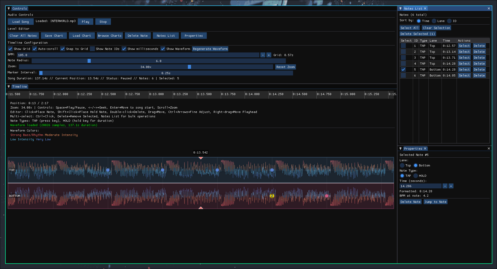
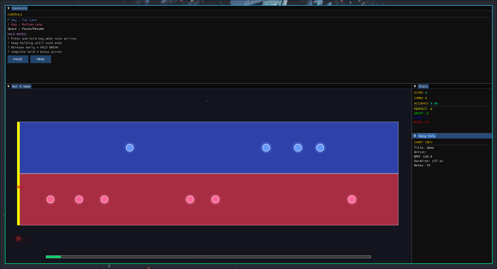

# Not A Rhythm Game

A free and open-source rhythm game inspired by Muse Dash, featuring an easy-to-use level editor and support for any music genre. Built with C++ and ImGui for a modern, responsive interface.

## What does it look like ?

**Good question !** Here is a sneak peek.

<details>
<summary>The Editor</summary>


</details>

<details>
<summary>The Player</summary>


</details>

## Why This Project Exists

First of all, I'm a huge fan of [Muse Dash](https://musedash.peropero.net/#/home), but I found the music genre selection too limited (nearly only J-core). I wanted to create an open-source alternative with an easy-to-use level editor, enabling the community to create anything.

This project is also an excellent excuse for me to try [ImGui](https://github.com/ocornut/imgui), which turned out to be fantastic.

My focus is currently on the creation of demo charts. Has level design is kinda hard to master, feel free to contribute with your own charts!

## Roadmap

Here are some of next steps I aim to achieve:

- [x] Create the Core classes
- [x] Add the Editor
- [x] Add charts saving version 1
- [x] Add the chart Player
- [x] Add waveform visualization in the editor
- [x] Update charts to version 2 (HOLD notes)
- [ ] Create demo charts
- [ ] Add more notes types (obstacle, disapparing, etc.)
- [x] Add a full keyboard navigation support
- [ ] Cleanup the UI & enhance the UX

For a more in depth view of the roadmap, please refere to the [issues](https://github.com/Mael-RABOT/NotARhythmGame/issues) page.

## Installation

### Prerequisites
- C++17 compiler (GCC 7+, Clang 5+, or MSVC 2017+)
- OpenGL 3.3+
- GLFW 3.3+
- BASS audio library

### Building from Source

1. **Clone the repository**
   ```bash
   git clone https://github.com/yourusername/NotARhythmGame.git
   cd NotARhythmGame
   ```

2. **Install dependencies**

   **Ubuntu/Debian:**
   ```bash
   sudo apt update
   sudo apt install build-essential libglfw3-dev libopengl-dev
   ```

   **Arch Linux:**
   ```bash
   sudo pacman -S base-devel glfw-x11 mesa libsndfile
   ```

3. **Download BASS audio library**
   - Download BASS from [un4seen.com](https://www.un4seen.com/)
   - Place `libbass.so` (Linux) in the `libraries/` directory

4. **Build the project**
   ```bash
   make re
   ```

5. **Run the game**
   ```bash
   ./NotARhythmGame
   ```

## Usage

### Playing Charts

1. **Launch the game** - The main menu will appear
2. **Browse charts** - Use the chart browser to find `.chart` files
3. **Load a chart** - Double-click or select and load a chart
4. **Start playing** - Click "Start a Not Game" to begin
5. **Controls**:
   - **F key** - Hit notes in the top lane
   - **J key** - Hit notes in the bottom lane
   - **Space** - Pause/Resume

### Creating Charts

1. **Open the editor** - Launch the game and select editor mode
2. **Load audio** - Import your music file
3. **Set BPM** - Use the audio analyzer or manually set the BPM
4. **Place notes** - Click on the timeline to place tap notes, drag for hold notes
5. **Test your chart** - Use the preview mode to test your creation
6. **Save your chart** - Export as a `.chart` file

### Chart File Format

Charts are saved in a custom binary format that includes:
- Chart metadata (title, artist, BPM, duration)
- Embedded audio data
- Note data (timing, lane, type, duration for holds)
- Version information for compatibility

### Version

The version 1 was only used during early development, only tap notes are supported.
The version 2 is the current version, and it supports both tap and hold notes.

> I will try to keep the retro compatibility with the previous versions as the project evolves.

### Layout

The ImGui docking version was used in the project, enable user to redo the layout of the application to their liking.

> Simply drag and drop the windows to the desired position while holding shift.

## Development

### Project Structure
```Makefile
NotARhythmGame/
├── src/                 # Source files
│   ├── main.cpp        # Entry point
│   ├── App.cpp         # Main application
│   ├── Player.cpp      # Game player logic
│   ├── Editor.cpp      # Level editor
│   ├── SoundManager.cpp # Audio management
│   └── AudioAnalyzer.cpp # Audio analysis
├── include/            # Header files
├── imgui/              # ImGui library
├── libraries/          # External libraries
├── assets/             # Game assets
└── Makefile           # Build configuration
```

### Key Components

- **Player**: Handles gameplay, input processing, and scoring
- **Editor**: Provides chart creation tools with real-time preview
- **SoundManager**: Manages audio playback using BASS library
- **AudioAnalyzer**: Performs beat detection and frequency analysis
- **ImGui Integration**: Modern, responsive UI framework

## Contributing

All contributions are welcome! Here's how you can help:

### Ways to Contribute
- **Charts** - Create and share chart files
- **Bug reports** - Report issues you encounter
- **Feature requests** - Suggest new features or improvements
- **Code contributions** - Submit pull requests for bug fixes or new features
- **Documentation** - Help improve documentation and guides
- **Testing** - Test on different platforms and report issues

## License

This project is licensed under the GNU General Public License v3.0 - see the [LICENSE](LICENSE) file for details.

## Acknowledgments

- **[Muse Dash](https://musedash.peropero.net/#/home)** - Inspiration for the gameplay mechanics
- **[ImGui](https://github.com/ocornut/imgui)** - Fantastic immediate mode GUI library
- **[BASS](https://www.un4seen.com/)** - Audio library for cross-platform audio support
- **[GLFW](https://www.glfw.org/)** - Cross-platform library for OpenGL context creation
- **[OpenGL](https://www.opengl.org/)** - Graphics API for rendering

## Support & Feedback

- **Issues**: Report bugs and request features on GitHub
- **Discussions**: Join discussions about features and improvements
- **Email**: Contact for general inquiries

Your feedback and contributions help make this project better for everyone!
